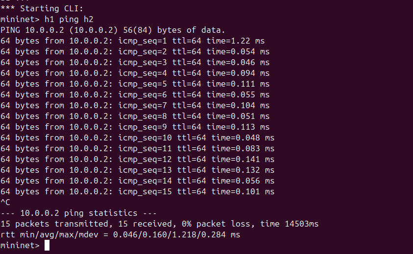
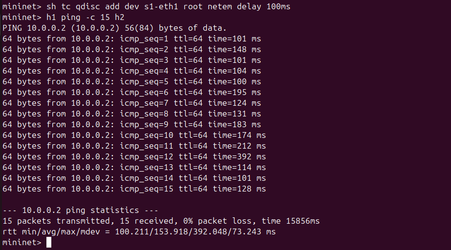

# Network Delay Measurement Tool using Mininet

## 📌 Objective

To measure and analyze network latency (RTT) between hosts using Mininet, and identify different traffic types such as ICMP and TCP.

## 🛠 Tools Used

* Mininet
* Ping (ICMP)
* tc (Traffic Control - netem)
* iperf (TCP traffic)
* tcpdump (Packet capture)

## 🌐 Topology

A single switch topology with 3 hosts was created using:

sudo mn --topo single,3

## 📊 Methodology

1. Created Mininet topology
2. Measured RTT using ping
3. Introduced artificial delay using `tc netem`
4. Measured RTT again
5. Identified traffic types using tcpdump and iperf

## 📈 Results

| Scenario | Path    | Avg RTT (ms) |
| -------- | ------- | ------------ |
| Normal   | h1 → h2 | 0.160        |
| Normal   | h1 → h3 | 0.141        |
| Delayed  | h1 → h2 | 153.918      |
| Delayed  | h1 → h3 | 119.880      |

## 🔍 Traffic Identification

### ICMP Traffic

* Generated using:

h1 ping h2

* Observed using tcpdump as ICMP echo request/reply

##  Screenshots

Example:

##  Observations

* RTT increased significantly after adding delay
* Delay affects both forward and reverse paths
* Variation in RTT occurs due to network conditions
* ICMP is used for latency measurement
* TCP is used for reliable data transmission

##  Conclusion

This project demonstrates how network delay affects communication between hosts. Using Mininet and traffic control tools, we successfully simulated network conditions and analyzed their impact on performance.

